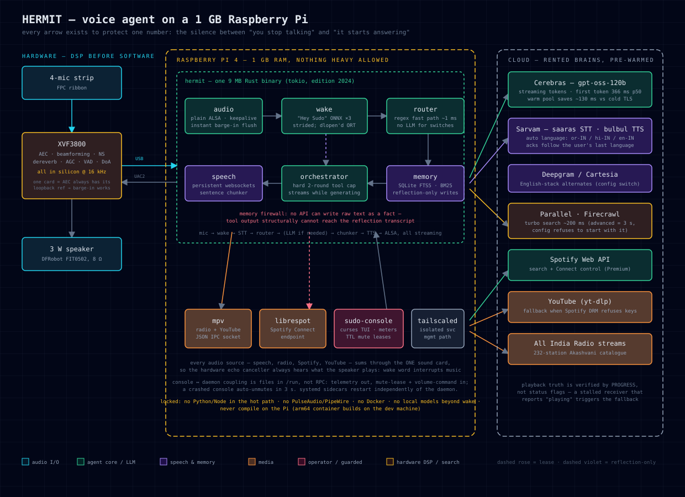

<div align="center">

# HERMIT

**A voice-first personal agent that lives on a 1 GB Raspberry Pi.**

One Rust binary · five tools · four-layer memory · hardware echo cancellation

*by Sudo Automations*

</div>

---

HERMIT is the reference build of the Sudo agent harness: a headless voice
assistant engineered around one number — the silence between "you stop
talking" and "it starts answering". Every architectural decision in this
repository is downstream of that latency budget.

It runs on a Raspberry Pi 4 with 1 GB of RAM, a reSpeaker XVF3800 mic array,
and a 3 W speaker. It wakes on "Hey Sudo", answers in Hindi, Odia, or English,
plays All India Radio and Spotify, and remembers what matters — while fitting
the entire agent, wake word included, in a single 9 MB binary.



The shape of the system, in one sentence: hardware does the signal processing,
one Rust binary does the agent, rented cloud does the intelligence — and
everything between microphone and speaker streams.

## Measured performance

`hermit/scripts/bench.sh` gates every release; it exits non-zero if any p50
misses. Numbers below are measured on the Pi over Wi-Fi against live services,
not estimated.

| Gate | Target | Measured |
| --- | --- | --- |
| Local harness overhead (route + recall + assemble) | ≤ 15 ms | **1.1 ms** |
| Fast-path device command (pause / volume / next) | < 50 ms, no LLM | **1.0 ms** |
| Text: first token, no tools | < 700 ms | **366 ms** |
| Voice: first audio, no tools | < 1.2 s | gated on TTS key |
| Voice: first audio, one web search | < 2.0 s | gated on TTS + search keys |

Connection pre-warming alone is worth ~130 ms: a cold TLS handshake reaches
first byte in 497 ms p50, the daemon's pooled warm connection in 366 ms.

## What's in the box

| | |
| --- | --- |
| `hermit/src/router.rs` | Regex fast path: pause, volume, named radio — answered in ~1 ms with no LLM call |
| `hermit/src/orchestrator.rs` | The turn loop, with a *hard* two-round tool cap (schema-starved final round, stray calls dropped) |
| `hermit/src/memory/` | SQLite + FTS5 (BM25, no embedding model) behind a structural write firewall |
| `hermit/src/speech/` | Streaming STT/TTS over persistent websockets, sentence chunker, and the project's own "Hey Sudo" wake word — a 3-graph ONNX pipeline ported from the Python reference and verified numerically against it |
| `hermit/src/audio/` | Single-card ALSA path with instant barge-in flush and AEC keepalive |
| `hermit/src/music/` | mpv IPC for internet radio (232-station Akashvani catalogue) + Spotify via librespot |
| `hermit/tools/sudo-console.py` | Dependency-free curses operator console: live meters, transcripts, mute leases, volume |
| `hermit/deploy/` | provision.sh, systemd units, scoped sudoers, ALSA config — the full device story |

## Quick start

Never compile on the Pi; the 1 GB of RAM is for inference-adjacent work, not
rustc. Builds run in an arm64 container on your dev machine.

```bash
cd hermit
scripts/build-pi.sh                # arm64 binary via rust:1-bookworm container
scripts/deploy.sh <pi-host>        # rsync binary + config + firmware
cargo test                         # 232 tests; no network, no API keys
```

Then flash the mic-array firmware, run `deploy/provision.sh` on the Pi, fill
`/etc/hermit/hermit.env`, and start the service. `docs/BRINGUP.md` in
`hermit/` walks the hardware phase; `deploy/README.md` covers the rest.

## Design positions

**Latency is a budget, not a hope.** Persistent TTS websockets (a cold
handshake costs 100–400 ms against a 1.2 s first-audio budget), HTTP
pre-warmed at boot and re-warmed every 4 minutes, and a sentence chunker that
starts speaking the first clause while the model is still generating.

**The memory firewall is structural.** There is no API to insert raw text as
a fact. The only write path is a typed `ReflectionBatch` built from the
reflection model's own JSON; tool output can never enter the transcript that
reflection reads. `tests/memory_firewall.rs` proves it with a poisoned page.

**Device control never waits for a model.** "Pause", "volume up", and "play
akashvani cuttack" resolve by regex against configured stations in about a
millisecond. The LLM is for questions, not for switches.

**One sound card, on purpose.** Every audio source — speech, radio, Spotify —
sums through the XVF3800, so the hardware echo canceller always has its
loopback reference. That is what lets the wake word interrupt music. The
console's mutes are TTL leases (a crashed console can never leave the device
deaf or silent); its volume is an edge-triggered command that coexists with
voice control instead of fighting it.

**No embedding model.** BM25 over FTS5 costs zero RAM and, on a personal
corpus, retrieves as well as a small embedder would.

**Nothing heavy in the hot path.** No Python or Node between microphone and
speaker, no PipeWire/PulseAudio (plain ALSA), no Docker on the Pi, no local
models beyond the wake word, and no compiling on the Pi — its 1 GB is spoken
for. These are locked positions, not defaults to tune.

## Operator console

`sudo-console` ships with the device: a zero-dependency curses TUI with live
RMS and wake-score meters, interim transcripts, the running conversation, and
guarded lifecycle controls (`m` mic, `s` speaker, `-`/`+` volume, `r`/`b`/`p`
restart/reboot/poweroff behind a y-confirm and a narrowly scoped sudoers
helper — the TUI itself never holds root).

## Honest limitations

- Spotify Connect requires Premium; playback health further depends on
  upstream librespot ↔ Spotify key-service behaviour.
- Apple Music cannot be driven by an agent on Linux; AirPlay push works, agent
  control does not.
- This is a 16 kHz voice pipeline into a 3 W mono driver — engineered for
  speech, news, and casual listening, not hi-fi. The single-card topology is
  load-bearing (it is the AEC reference); do not "fix" it.
- Turbo web search covers English and Japanese; other Latin-script languages
  are not language-detected on-device (a language-ID model does not fit the
  RAM budget).
- Live radio has no "next track". The device says so instead of ignoring you.

## Repository layout

```
hermit/          the agent: source, config, deploy, docs, tools
  src/           Rust daemon (edition 2024)
  config/        hermit.toml, prompts, skills, stations.toml
  deploy/        provision.sh, systemd units, Cross.toml, asound.conf
  tools/         sudo-console.py + tests
  docs/          BRINGUP.md hardware checklist
  scripts/       build-pi.sh, deploy.sh, bench.sh, phase0.sh
CLAUDE.md        agent-facing repo instructions
```

A deeper technical README — including hardware findings like the XVF3800's
playback-slaved capture clock and measured AEC suppression — lives in
[`hermit/README.md`](hermit/README.md).
